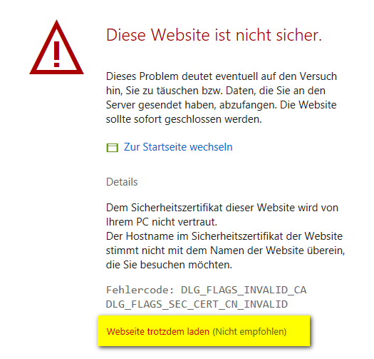

# Introduction 
AHUB is a framework for deploying analytical application inside docker containers.


The framework aims at providing a unified approach to run scripts in any language (R, Python, etc...) while offering common services for most deployment scenarios:

- a graphical user interface
- access control (via Basic Auth, Active Directory or AAD)
- process management and logging functionality
- easy scalability

# Getting Started

For running the demo environment you need to install docker. Please follow the official guide on the docker homepage.

[Getting started with Docker!](https://www.docker.com/get-started)

Once docker is running (make sure it is configured to run "Linux containers"), you can run the demo on bash or powershell with the following command.

```(powershell)
docker stack deploy -c .\docker-compose.yml ahub
```

Alternatively on Windows you can just use the Powershell script *deploy.ps* in the main folder.

The docker daemon then loads all images from the public image registry at [docker hub](https://hub.docker.com) and starts all services.

You can test the deployed application at http://localhost/ to access the GUI. As the SSL certificate if self-signed, you need to skip the browser warning. The user credentials for the basic authentication are:



**Username:** ahub

**Password:** ilikebigwhales


**Node 1 and Node 2** have dummy processes implemented:

* A **thread** process: runtime 1 sec (this could be scoring of a trained model)
* A **batch** prochess: runtime 20 seconds (this could be the training of a model)

Important to note is, that the API for the **batch process** is implemented responsively, meaning, that while the process is running you can repeatedly trigger the API and get a response with the current process status.

**Node 3** provides an interactive timeseries forecast plot (with the prophet library) which is then displayed by the GUI.

Each individual analytical node can also be accessed directly (without GUI) at:

- https://localhost/node1/thread 
- https://localhost/node1/batch
- https://localhost/node2/thread
- https://localhost/node2/batch
- https://localhost/node3/ - shows demo forecast with prophet

This demonstrates how another application or a scheduler would access the node functionalities.

# Build and Test
TODO

# Contribute

Please get in contact with me at mailto:martin.hanewald@qunis.de if you are intersted in contributing.