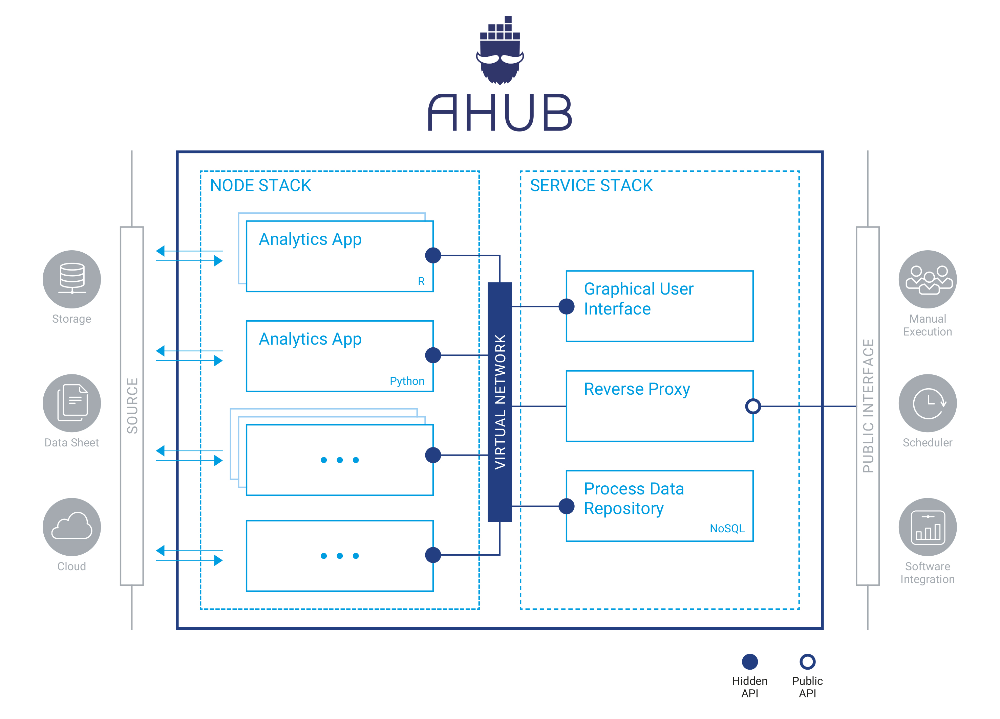
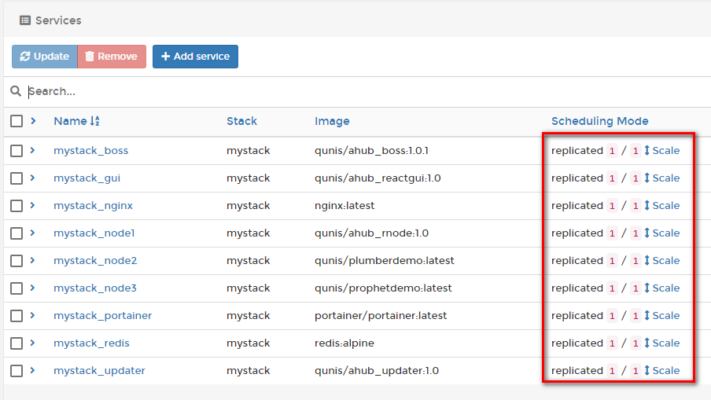
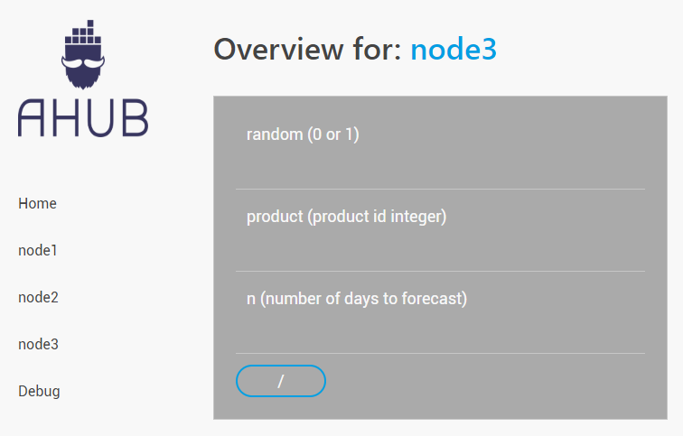

*Attention: The master branch has been reduced to only contain the config files to run AHUB. The source code for all containers can now be found under the dev branches.*


# Introduction 
AHUB is a framework for deploying analytical applications inside docker containers.



The framework aims at providing a unified approach to run scripts in any language (R, Python, etc...) while offering common services for most deployment scenarios:

- a graphical user interface
- access control (via Basic Auth, Active Directory or AAD)
- process management and logging functionality
- easy scalability

Docker swarm is able to run a collection of containers simultaneously such that they can communicate with each other over a shared virtual network. Docker swarm has a multitude of features which makes it a powerful tool even in large scale deployment. AHUB provides a pre-configured swarm setup to deploy analytical containers (based on R or any other language) with minimal effort.

# Getting Started

## Generating user credentials

For using the simple configuration with HTTP Basic Authentication AHUB comes with a pre-generated password file. But of course you want to create your own. This is very quickly done, with a helper container. All you need to do is run the following command in your cloned folder (please fill in your username and password). This will create a **.htpasswd file** containing the MD5 hashed credentials for your user.

```bash
docker run --mount type=bind,src=$pwd,dst=/var qunis/htpasswd username password
```

## Configuring the stack

Docker swarm operates with a recipe, telling it which containers to spin up, which ports to publish, which volumes to mount, et cetera. Everything you would normally  configure in a single "docker run ..." statement for a singular container instance, we instead write down in the so called **Compose file** when working with docker swarm. For a more detailed introduction see [here](https://docs.docker.com/engine/swarm/swarm-tutorial/). 

Please inspect the demo compose file in the main folder

```yaml
vversion: '3.3'
services:

# -------------------------------------------
# NODE STACK (add analytical modules here)
# -------------------------------------------
# For compatibility with AHUB, container images
# need to comply with the following:
#   - publish a REST API on port 8000
#   - provide a swagger.json file in the "/" path (only for GUI)
# -------------------------------------------

  node1:
    image: qunis/ahub_rnode:1.0

# -------------------------------------------
  
  node2:
    image: qunis/plumberdemo

# -------------------------------------------
  
  node3:
    image: qunis/prophetdemo


# -------------------------------------------
# SERVICE STACK (DO NOT TOUCH)
# -------------------------------------------

  boss:
    image: qunis/ahub_boss:2.0
    volumes:
      - "/var/run/docker.sock:/var/run/docker.sock"
    configs:
      - source: main_config
        target: /app/config.yaml


# -------------------------------------------
# CONFIGS & SECRETS
# -------------------------------------------
        
configs:
  main_config:
    file: ./config.yaml

secrets:
  htpasswd:
    file: ./.htpasswd

```

The **first block** defines the **node stack**. Here you can add as many container images as you like or exchange the existing ones. For compatibility with AHUB it is only required that plumber (or any other API) publishes on port 8000 and provides the Swagger definition file (if you want to use the GUI functionality). The latter is achieved by running the plumber *$run* command with parameter swagger=TRUE.

**Important:** The analytical nodes do not have to be R based. A python node running a combination of *flask/flasgger* would be compatible as well.

The **second block** is the companion container for running **AHUB**. This container will take care of ramping up all the sidecar containers of the service stack (like nginx, certbot, redis, gui, etc..) and configures them accordingly. 

The **third block** references the main configuration file for **AHUB** (see next section) and your previously generated .htpasswd file.

For now you can either leave the demo compose file as is or add/substitute your own container images in the node stack! 

## Configuring AHUB

Please inspect the second YAML file in the main folder: **config.yaml**

```yaml
# --------------------------------------------------------------------
# --------------------------------------------------------------------
# AHUB CONFIG FILE
# --------------------------------------------------------------------
# --------------------------------------------------------------------
VERSION: 2.0


# --------------------------------------------------------------------
# TLS / SSL (Encryption)
# --------------------------------------------------------------------
# Currently the following encryption methods are supported
#   self-signed:    A self-signed certificate will be created by ahub. 
#                   This leads to browser warning, which can be skipped.
#   letsencrypt:    AHUB will automatically apply for a certificate from
#                   Let's Encrypt certificate authority. For this to work
#                   you need to deploy AHUB on a public machine and provide
#                   a fully qualified domain name (FQDN).
TLS_TYPE: self-signed 

# -- optional -- (for TLS_TYPE: letsencrypt)
#TLS_HOST: myserver.cloud.com  # the public domain name (FQDN) 
                                              # you want to apply the certificate for
#TLS_EMAIL: me@cloud.com # contact email-address


# --------------------------------------------------------------------
# Authentication
# --------------------------------------------------------------------
# Currently the following authentication methods are supported
#   none:       Authentication disabled
#   basic:      HTTP Basic Authentication with username and password
#   aad:        Authentication via Azure Active Directory
# when choosing 'basic' you need to provide a file '.htpasswd' in the main folder.
AUTH_TYPE: basic

(...continues...)
```

This file contains the configuration for authentication and encryption options. For Basic Authentication with username and password (with you previously generated .htpasswd file) and a self-signed certificate you can leave this as is. Otherwise change the settings according to the description in the config file.


## Launching the stack

Before we launch AHUB we need to prepare the docker daemon to run in swarm mode:

```bash
> docker swarm init
Swarm initialized: current node (XXX) is now a manager.
```
The whole stack can be launched by docker in swarm mode with the following command
```bash
docker stack deploy -c ./ahub.yml mystack
```
This command references the Compose file *ahub.yaml* to deploy a stack called *mystack*. Of course you can change the name of your stack to your liking.You should see the following output on the shell:
```bash
> docker stack deploy -c ./ahub.yaml mystack

Creating network mystack_default
Creating secret mystack_htpasswd
Creating config mystack_main_config
Creating service mystack_node2
Creating service mystack_node3
Creating service mystack_boss
Creating service mystack_node1

>
```
AHUB comes with an instance of **Portainer**, a very powerful browser-based container management tool. We can start checking if everything ramped up fine, by navigating to http://localhost/portainer/ (the trailing slash is important!!!).

As you are starting this cluster for the first time, you need to set an admin account and then choose the **Local mode**. After that you get to the Portainer main page, where you can click through the items Services, Containers and what else piques your interest. With Portainer you can do almost anything you can do from the docker command line interface.

Under the Services tab you should see 9 services if you stuck to the demo file. Three of them being the nodestack comprising of node1, node2 and node3. Everything is fine when you see a 1/1 behind each service.



## Checking the API endpoints
You can now navigate to your endpoints via https://localhost/{nodename}/{endpoint}?{parameters}. For example https://localhost/node2/?plot or https://localhost/node3/?n=24. You will be warned by your browser about the insecure certificate (because we have self-signed it, skip this warning) and be asked for the user credentials.

There is also a rudimentary GUI at https://localhost/gui/ (still under development) showing you the various nodes and their endpoints so you can manually trigger a GET request for testing purposes.




# Contribute

Please get in contact with me at [martin.hanewald@qunis.de](mailto:martin.hanewald@qunis.de) if you are interested in contributing. I am especially looking for a frontend developer. So if you are keen on ReactJS, give me a shout.
